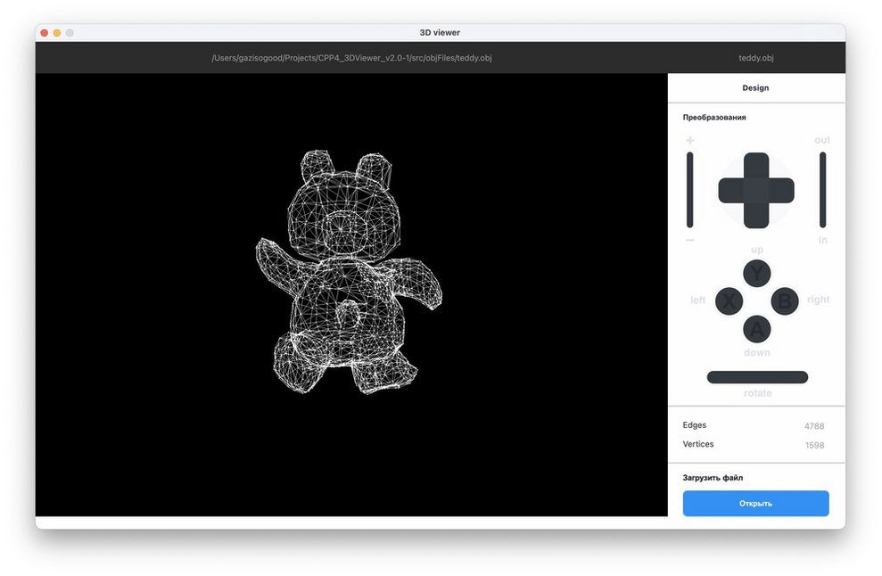

# 3DViewer v2.0

Разработка программы 3DViewer v2.0.

## Описание

Предыдущая версия 3DViewer была написана на языке Си. В данном проекте реализовано приложение на языке С++ для просмотра 3D моделей в каркасном виде. Оно позволяет <b>загружать</b> каркасную модель из файла формата obj (поддержка только списка вершин и поверхностей); <b>перемещать</b> модель на заданное расстояние относительно осей X, Y, Z; <b>поворачивать</b> модель на заданный угол относительно своих осей X, Y, Z; <b>масштабировать</b> модель с определенным шагом.



## Использование

- Запустите приложение.<br>
- Нажмите на кнопку открыть и загрузите файл .obj с объектом из папки 3DViewer/src/objFiles.<br>
- Используйте следующие кнопки:<br>
<b>Поворот вокруг оси:</b> Нажимайте кнопки `A`, `B`, `X`, `Y` и `rotate` с правой и левой стороны для поворота объекта вокруг осей x, y, и z.<br>
<b>Перемещение:</b> Нажимайте кнопки `left`, `right`, `up`, `down`, `in`, `out`, чтобы перемещать объект в зоне видимости по соответствующим направлениям.<br>
<b>Масштабирование:</b> Нажимайте кнопки `+`, чтобы приблизить и `-` чтобы отдалить объект.<br><br>
  


## Установка
Дла установки необходимы Qt версии 6, cmake, make и GCC компилятор.

```bash
git clone https://github.com/polings/3DViewer.git
cd 3DViewer/src
make install
```

## Для разработчиков

Проект разработан с использованием MVP паттерна, фреймворк Qt6, на языке C++17.
Для визуализации объекта используется библиотека OpenGL.
Для тестирования преобразования модели были написаны unit-тесты. Для запуска тестов и проверки их покрытия необходимы библиотеки GTest и lcov. Запустите команды:
```bash
cd 3DViewer/src
make gcov_report
```

## Контрибьюторы

Программа была написана в рамках группового проекта для "Школы 21" от Сбер.

[__Polina Sh__](https://github.com/polings)<br>
[__Artur Gaiazov__](https://github.com/gazisogood)<br>
